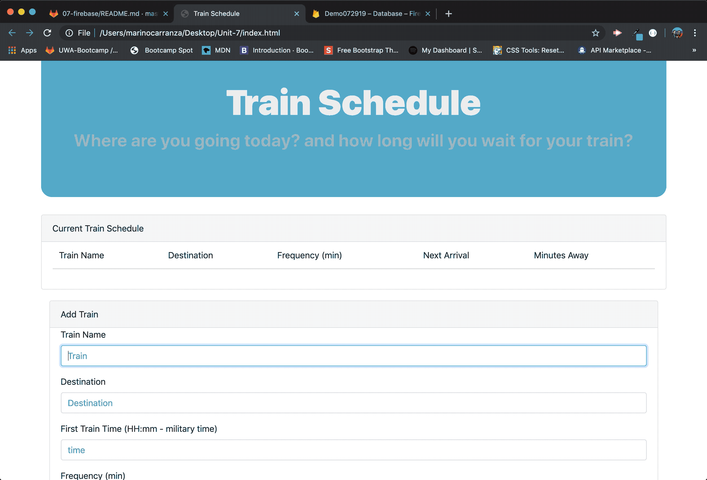
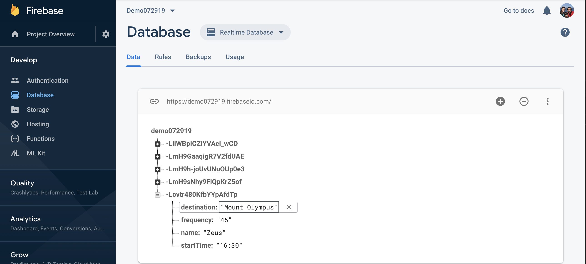

# **Train Schedule**

# **Description**

The app takes user input and saves it to the cloud using AJAX in tandem with Firebase's API.

The Train Schedule app creates a schedule that incorporates Firebase to host arrival and departure data.

Client Side Storage: uses cookies, sessionStorage, and localStorage to save and reuse user data across a user’s session.

Server Side Storage: saves user info to a database that can be reused across multiple devices and sessions. Firebase is used to accomplish this.

## **Usage**
The app retrieves and manipulates the information provided by the user with Moment.js.
The website provides up-to-date information, namely the arrival times and how many minutes remain until the next arrival.

## **Tecnologies used:**
•  HTML

•  CSS

•  Bootstrap

•  Javascript

•  JQuery

•  Firebase

•  Ajax

## **Visuals**

## **Data stored in Firebase**

## **Support**
Feel free to contact me marino.carranza@gmail.com with questions questions, suggestions or ideas.

## **Contributing**
I am the only one taking care of this app at the moment, would you feel the inclination to clone/fork this repository to add your own flavor to it, feel free to do so; I just ask you to let me know.  Thanks.

##  **Acknowledgments**
I would like to thank Catherine Pham and Arron Linton for their tireless guidance and patience.

#### Thanks for taking the time to look at my app.
**Mariño Carranza**

marino.carranza@gmail.com