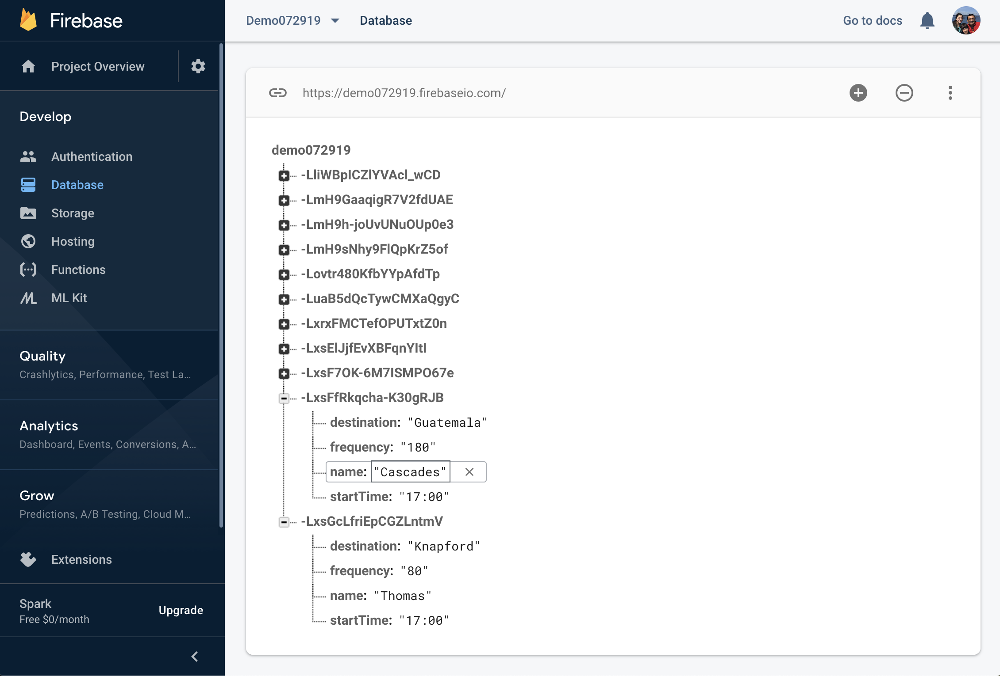

# **Train Schedule**

This app sets up a Firebase system to store remote data.
The app takes user input and saves it to the cloud using AJAX in tandem with Firebase's API.

The Train Schedule app creates a schedule that incorporates Firebase to host arrival and departure data.
The app retrieves and manipulates the information provided by the user with Moment.js.
The website provides up-to-date information, namely the arrival times and how many minutes remain until the next arrival.

Client and Server side storage are used in this exercise.

Client Side Storage: uses cookies, sessionStorage, and localStorage to save and reuse user data across a user’s session.

Server Side Storage: saves user info to a database that can be reused across multiple devices and sessions. Firebase is used to accomplish this.

### **Tecnologies used:**

HTML, Bootstrap, javascript, JQuery, Firebase, Ajax.

#### **Working example**

#### **Shows Data stored in Firebase

#### Thanks for taking the time to look at my app.
**Mariño Carranza**

marino.carranza@gmail.com